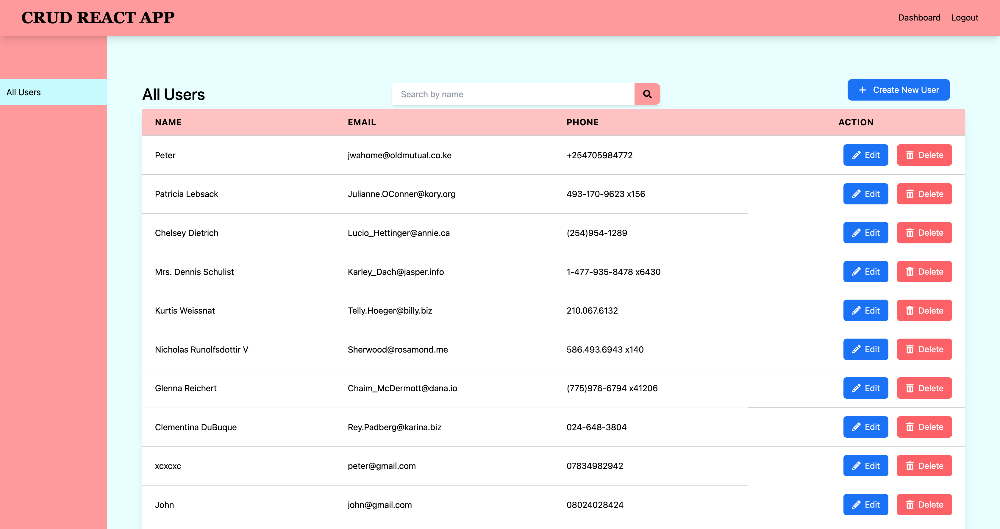
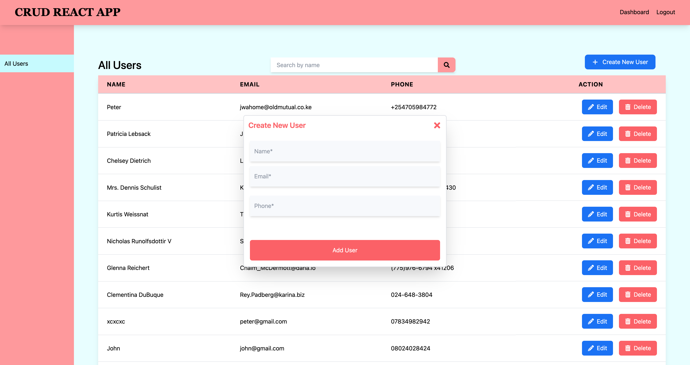

# Smart Apps React Test - CRUD Application





This is a **React.js** application that performs full **CRUD** (Create, Read, Update, Delete) operations on a list of users. The app fetches initial data from an external API and allows users to manage this data, with local changes stored in **localStorage** or **Redux**.

## Features

- Fetches user data from an external API (`https://jsonplaceholder.typicode.com/users`).
- Displays user data in a table with options to add, edit, and delete users.
- Persists user data in localStorage or Redux.
- Search functionality to filter users by name.
- Error handling for API failures.
- Form validation for adding and editing users.
- Optimized UI updates and rendering.


## Installation

### Prerequisites
Ensure you have **Node.js** and **npm** installed.

1. Clone the repository:
   ```bash
   git clone https://github.com/your-username/smart-apps-react-test.git
   cd smart-apps-react-test

   smart-apps-react-test/

2. Run npm install to install the dependencies
   ``npm install``
3. Run the Application
   `` npm run dev``

